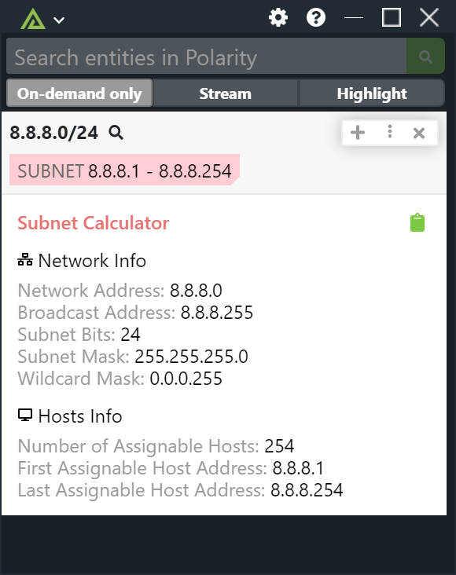

# Polarity Subnet Calculator Integration

Polarity's Subnet Calculator Integration allows users to search IPv4 addresses in CIDR notation to return calculated information about the network and host bounds.

This integration does not make any network requests.

## Installation Instructions

Installation instructions for integrations are provided on the [PolarityIO GitHub Page](https://polarityio.github.io/).

## Polarity

Polarity is a memory-augmentation platform that improves and accelerates analyst decision making.  For more information about the Polarity platform please see:

https://polarity.io/
